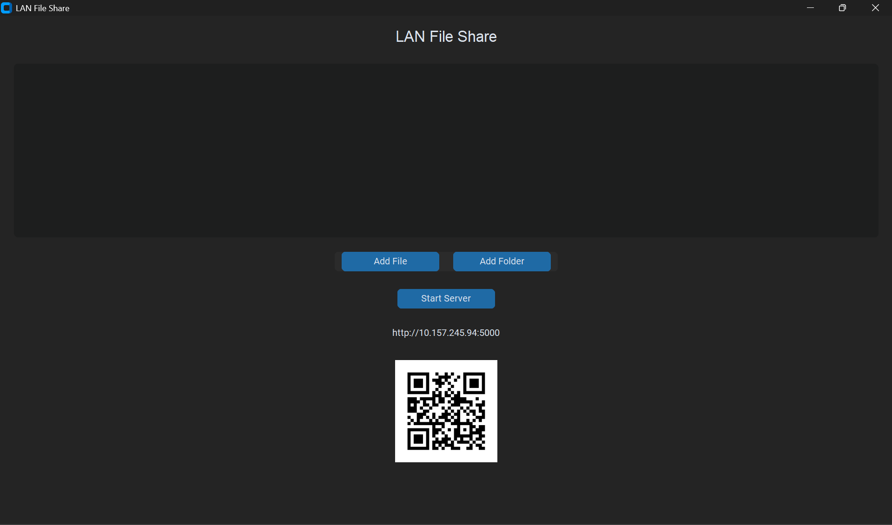
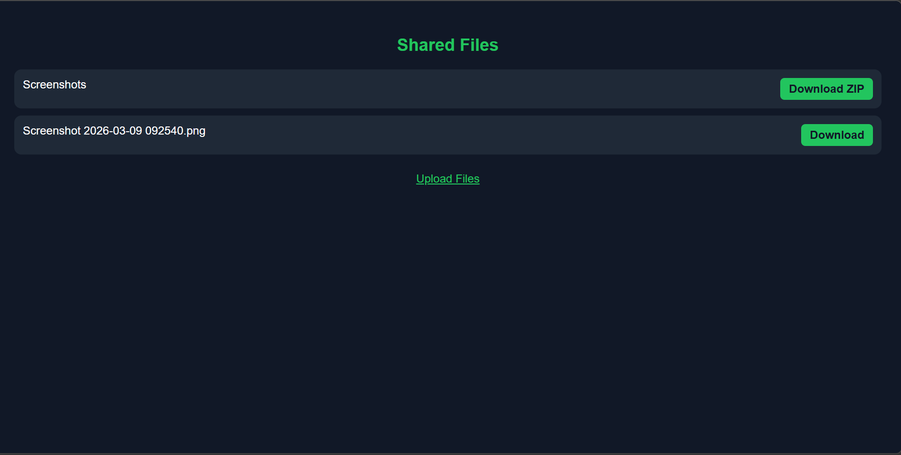
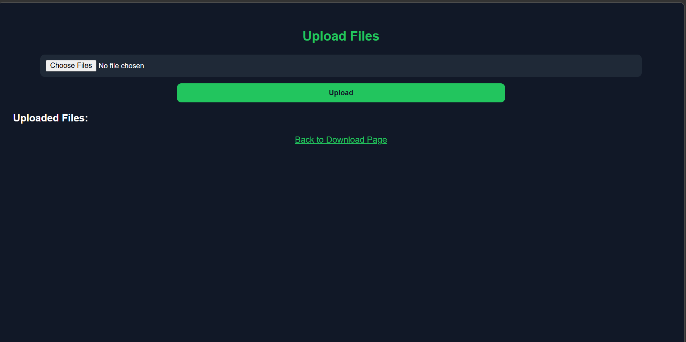

# LAN File Share  

**LAN File Share** is a lightweight Python application that allows you to quickly share files and folders between devices on the same local network. It combines a modern desktop GUI with a browser-based interface, enabling fast file transfers without internet or cloud services.

---

## Features

* Modern **desktop GUI** built with CustomTkinter
* Share **files and folders** over LAN
* **QR code** for quick mobile access
* **Mobile-friendly web interface** (works in any browser)
* Download files or folders (**ZIP**)
* Upload files from connected devices
* Real-time updates of shared files
* Fully offline operation
* Portable **EXE** for Windows – no installation required

---

## How to Use

### 1. Daily Use (Portable EXE)

* Download the pre-built **EXE** from the [Releases](#) section.
* The EXE is **portable**: no installation required on Windows.
* Run it, add files/folders, and start the server.
* Mobile devices can access shared files directly via a **browser** using the link or QR code – no installation needed.

### 2. Customization / Development

If you want to modify or extend the project:

1. Clone the repository:

```bash
git clone https://github.com/yourusername/lan-file-share.git
cd lan-file-share
```

2. **Install dependencies individually** to avoid conflicts:

```bash
pip install customtkinter
pip install Flask
pip install qrcode[pil]
pip install Pillow
```

3. Run the Python script:

```bash
python main.py
```

You can now customize the GUI, Flask routes, file handling, or other features.

---

## Recommended Use

* Use the **portable EXE** for quick daily file sharing on Windows.
* Use the **Python source code** to **customize or extend** functionality.
* Mobile devices only need a **browser** to upload/download files; no installation required.

---

## Technologies Used

* Python
* CustomTkinter
* Flask
* Pillow (PIL)
* QRCode

---

## Screenshots






